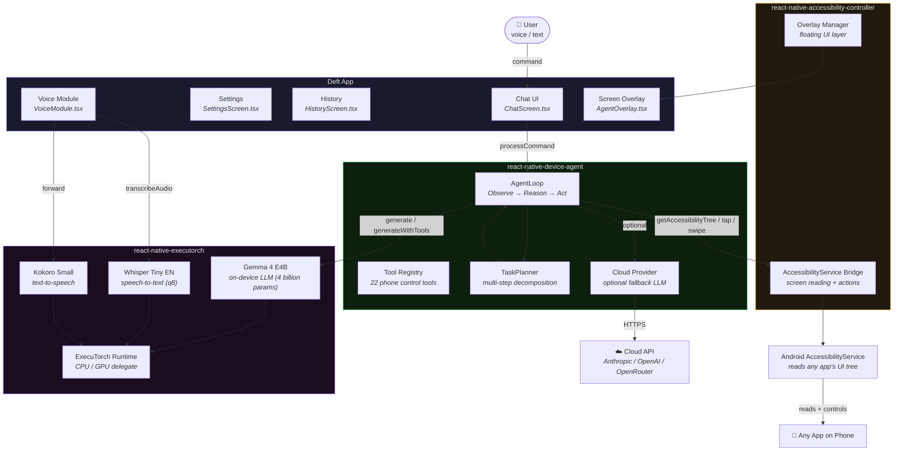

# Deft Architecture

## System Diagram

## Component Descriptions

### Deft App
The consumer Android app built with Expo and React Native. Provides a chat interface for natural-language commands, a settings screen for model and agent configuration, a session history screen, a screen overlay showing real-time agent actions, and a VoiceModule that bridges Kokoro TTS and Whisper STT to the rest of the app.

### react-native-device-agent
The core agent orchestration library. `AgentLoop` runs the observe→reason→act cycle: reads the screen, sends context to the LLM, executes the chosen tool, then repeats. `TaskPlanner` decomposes complex requests into subtasks before delegating to `AgentLoop`. `ToolRegistry` manages 22 phone-control tools (tap, swipe, type, scroll, open app, global actions, find node, etc.). `CloudProvider` supports Anthropic, OpenAI, and OpenRouter as optional cloud LLM backends.

### react-native-accessibility-controller
A TurboModule wrapping Android's `AccessibilityService`. Reads the full UI tree of any foreground app, dispatches gestures and typed input, takes screenshots, and manages a system-level floating overlay window.

### react-native-executorch
A fork of the Software Mansion ExecuTorch library with Gemma 4 chat template support, Whisper STT, and Kokoro TTS. Runs all inference on-device via the ExecuTorch runtime — no network required.

## Data Flow

1. User speaks or types a command in the chat UI.
2. If voice mode is active, VoiceModule captures audio and Whisper transcribes it.
3. The command is passed to `AgentLoop` (or `TaskPlanner` in plan mode).
4. Each loop iteration: read the accessibility tree → format prompt → call Gemma 4 (or cloud LLM) → parse tool call → execute action → observe result → repeat.
5. Completed agent text responses are read aloud via Kokoro TTS when voice mode or TTS is enabled.
6. All inference and phone control happens on-device. No user data leaves the phone (unless cloud fallback is explicitly enabled).

## Agent Patterns

For common multi-step patterns used by the agent (scroll-until-found, waiting for async UI, etc.) see [docs/agent-patterns.md](./agent-patterns.md).
